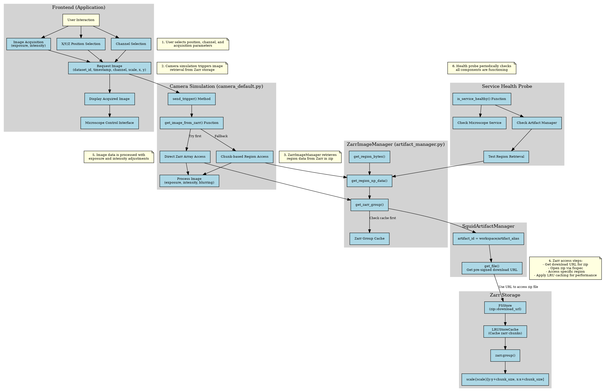

# Squid Control

The Squid Control software is a Python package that provides a simple interface to control the Squid microscope. The software is designed to be used with the Squid microscope (made by Cephla Inc.).

## Installation and Usage

See the [installation guide](./docs/installation.md) for instructions on how to install and use the software.

### Installation Options

Basic installation:
```bash
pip install .
```

For development (recommend):
```bash
pip install .[dev]
```

### Usage

To run the software, use the following command:
```bash
python -m squid_control --config HCS_v2
```

If you want to use a different configuration file, you can specify the path to the configuration file:
```
python -m squid_control --config /home/user/configuration_HCS_v2.ini
```

### Simulation Mode

To start simulation mode, use the following command:
```
python -m squid_control --config HCS_v2 --simulation
```

#### Simulated Sample (Zarr-based Virtual Sample)

The simulation mode includes a **virtual microscope sample** using Zarr data archives. This allows you to test the microscope software without a physical sample. The simulated camera retrieves image data based on the current stage position, applies exposure and intensity adjustments, and returns realistic microscopy images.

- The simulated sample consists of Zarr data stored in ZIP files containing high-resolution microscopy images.
- The `Camera_Simulation` class (in `camera_default.py`) handles simulated image acquisition.
- The `ZarrImageManager` retrieves image data from the Zarr archives, either by direct array access or by assembling the region from smaller chunks.
- The image is processed with the requested exposure time, intensity, and optional Z-blurring, then returned to the user.

**Workflow Diagram:**



#### Simulated Sample Features:
- Supports different imaging channels (brightfield and fluorescence)
- Adjustable exposure time and intensity
- Realistic Z-axis blurring for out-of-focus images
- High-resolution sample data covering the stage area

---

## About

 Cephla Inc. 

---

## Note

The current branch is a fork from https://github.com/hongquanli/octopi-research/ at the following commit:
```
commit dbb49fc314d82d8099d5e509c0e1ad9a919245c9 (HEAD -> master, origin/master, origin/HEAD)
Author: Hongquan Li <hqlisu@gmail.com>
Date:   Thu Apr 4 18:07:51 2024 -0700

    add laser af characterization mode for saving images from laser af camera
```

How to make pypi work:
 - Register on pypi.org
 - Create a new token in the account settings
 - In the repository setting, create a new secret called `PYPI_API_TOKEN` and paste the token in the value field
 - Then, if you want to manually publish a new pypi package, go to actions, select the `Publish to PyPi` workflow, and click on `Run workflow`.

---

**Tip:** For more details on the simulated sample and the Zarr workflow, see [Feature Introduction](./docs/feature_introduction.md).

