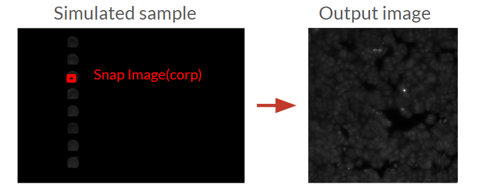

# Feature Introduction

1. **Stage Software Barrier**: The software barrier prevents the stage from moving beyond a certain area, ensuring that the stage does not collide with the microscope hardware.

    We have a function called 'is_point_in_concave_hull' that checks if a point is within the software barrier. The barrier is defined by a concave hull, which is a polygon that encloses the stage area. The file is 'edge_positions.json'. The points are in usteps instead of mm. Take X axis as a example. You can calculate the usteps from mm using this formula:

    ```
    // You can find these values in the configuration file
    CONFIG.STAGE_MOVEMENT_SIGN_X
            * int(
                Distance_mm
                / (
                    CONFIG.SCREW_PITCH_X_MM
                    / (CONFIG.MICROSTEPPING_DEFAULT_X * CONFIG.FULLSTEPS_PER_REV_X)
                )
            )
    ```
    The function 'is_point_in_concave_hull' will return True if the point is within the barrier, and False otherwise.

2. **Simulated Sample**: The simulated sample is a virtual sample that can be used for testing the microscope software without a physical sample. The simulated sample consists of Zarr data stored in ZIP files that contain high-resolution microscopy images. It's handled by the 'Camera_Simulation' class in the 'camera_default.py' file.

    When a user wants to acquire an image, the workflow for the simulated camera is as follows:

    - The user sends a command to the microscope service with position, channel, exposure, and intensity parameters.
    - The microscope service calls the functions in the 'Camera_Simulation' class.
    - The Camera_Simulation uses the ZarrImageManager to retrieve image data from the Zarr archives.
    - The ZarrImageManager first attempts direct access to the Zarr data for better performance.
    - If direct access fails, it falls back to a chunk-based approach, assembling the full region from smaller chunks.
    - The retrieved image is processed with the requested exposure time and intensity settings.
    - The processed image is returned to the user.

     

    Some areas in the stage don't have sample data. The simulated camera will return a default image in these areas. If you want to know the location of the sample data, you can check the 'docs/coordinates_of_fovs_simulated_sample.csv' file.

    ### Zarr Image Workflow

    The diagram below illustrates the workflow for retrieving images from Zarr archives:

    

    This workflow shows how the microscope control interface initiates requests for images, how the Camera_Simulation class processes these requests, and how the ZarrImageManager retrieves and processes data from Zarr archives stored in ZIP files.

The simulation mode includes a virtual microscope sample using Zarr data archives. This allows you to test the microscope software without a physical sample. The simulated camera retrieves image data based on the current stage position, applies exposure and intensity adjustments, and returns realistic microscopy images.

#### Simulated Sample Features:
- Supports different imaging channels (brightfield and fluorescence)
- Adjustable exposure time and intensity
- Realistic Z-axis blurring for out-of-focus images
- High-resolution sample data covering the stage area